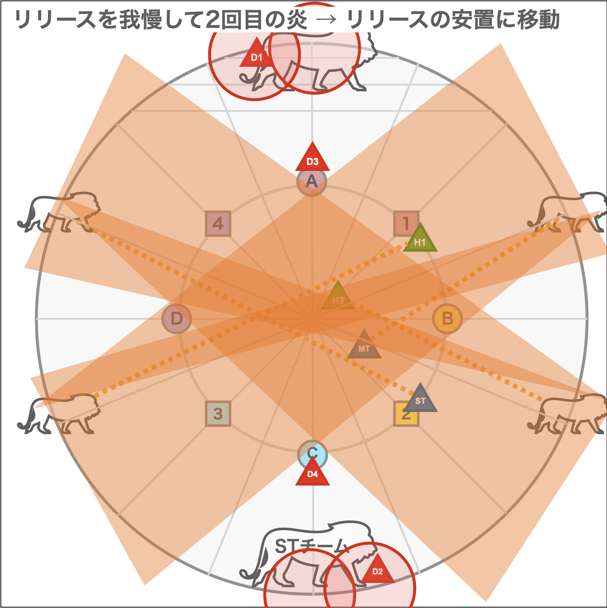

参考動画 : 前半 https://www.youtube.com/watch?v=82AeTjkQXQw

※ 一部変更

# マクロ

    /p 【シヴァ散開】   　　|   【ダスト頭割り・氷柱】
    /p   D3  MT  D4      |    D-1：H1MT←→D1D3
    /p   H1  ◎   H2      |　　　　　　　  ◎
    /p   D1  ST  D2      |    B-3：D4D2←→STH2
    /p 【タイタン1】       |   【タイタン2】
    /p   橙TH  黄T  橙D   |       　　　橙TH
    /p   黄H　　◎   黄D　  |    青：西H1H2MTSTD1234東
    /p         青D 　  　 |　　　　　　   橙D
    /p 【タイタン3】       |  【はなつ＋ビーム】
    /p   黄TH  橙   黄D   |    南/西
    /p         ◎         |  【石像】
    /p   青TH       青D   |    南誘導　南MT組　北ST組
    /p 【大ライオン】小ライオン(akito)
    /p   北：H1→MT→H1　/　D3→D1→D3
    /p   南：H2→ST→H2　/　D4→D2→D4

# 攻撃

## ダイアモンドダスト (DD)

         

## タイタン

### それぞれのマーカーについて

それぞれのマーカーについて

  

### 捨てる場所

    必ず一つの円に入って立つ

## はなつ + オブリタレーション

    安置で頭割り
    南 or 西 で頭割り

## 巨兵

        

    タンクは南にボスを誘導
    ↓
    ストックを覚える
    ↓
    ヒーラーに頭割りマーカー
    ↓
    南北で頭割り (南 : MTチーム, 北 : STチーム)
    ↓
    頭割り場所に巨兵登場
    ↓
    ランダムに巨兵と線で結ばれ、頭上に数字が表示される
    ↓
    悦楽の手 を避ける
    ↓
    頭の番号順に着弾 1番 → 2番
    ↓
    大きいボスの手が光る 光っている手を確認
    1,2番担当は手の近くに寄っておく
    ↓
    3番着弾
    ↓
    4番着弾 (スプリントで手のところに)
    ↓
    光っている手からのノックバック
    ↓
    リリースが来るので、安置に移動 (覚えておく)

このあたりで近接LB3 使えるそう

## ライオン

    ストック 安置を覚えておく
    ライオン出現
    悦楽の手 + タンク・ヒーラー or DPS に線がつく

  

### 大ライオン

      

### 小ライオン

     

# 後半

## 時間圧縮 序

早ファイガ

遅ファイガ

1回目のビーム処理後

遅ファイガのとき (遅ブリザガの場合は中央に集まる)
タンクは紫の線を見ておく

最後にノックバック後にMT, STチームで頭割り

## アポカリプス・シングル

タンクはボスを少しだけ向きをずらす
ボスが向いた方向の逆に行く (でかいAoE)
移動する光の出てきた方向と逆のボス背後に移動
中央が爆発したら駆け込み
頭割り
散開
中央に戻る

## 時間圧縮・破

 

## 時間圧縮・急

# タイムライン

### 参考 (https://xivlife.work/e12s-timeline/)

### 前半	

| 時間(詠唱開始) |                                      |  蛮神技範囲図(リリース・はなつ)  |
| -------------- | ------------------------------------ | -------------------------------- |
| 0:00           | 戦闘開始                             |                                  |
| 0:10           | マレフィキウム                       | 全体範囲                         |
| 0:29           | ジャンクション                       | シヴァorタイタン                 |
| 0:35           | 悦楽の手(えつらくのて)               | 230度範囲                        |
| 0:42           | 大地の重圧orアイスストーン           |                                  |
| 0:46           | はなつ                               | 繋がった前方の蛮神覚える         |
| 0:53           | はなつ着弾                           |                                  |
| 0:57           | 大地の重圧orアイスストーン           |                                  |
| 1:03           | 天罰の波動                           | MTSTに斬耐性・突耐性低下         |
| 1:16           | マレフィキウム                       |                                  |
| 1:32           | ジャンクション:シヴァ                |                                  |
| 1:41           | ダイアモンドダスト                   | 全体範囲                         |
| 1:53           | AoE+頭割りマーカー出現               |                                  |
| 2:06           | 氷柱から線付与                       |                                  |
| 2:17           | ノックバック着弾                     | ダメージあり                     |
| 2:22           | 氷柱からの線着弾                     | ダメージあり                     |
| 2:30           | マレフィキウム                       |                                  |
| 2:45           | ジャンクション:タイタン              |                                  |
| 2:54           | タイタン大地の怒り                   | 全体範囲                         |
| 3:04           | 岩落とし                             | 岩出現 ダメージあり              |
| 3:08           | マーカー付与                         | 橙4+青1+黄3                      |
| 3:13           | マーカー着弾                         |                                  |
| 3:17           | 岩落とし2                            | 岩出現 ダメージあり              |
| 3:21           | マーカー付与2                        | 橙6+青2                          |
| 3:26           | マーカー着弾2                        |                                  |
| 3:31           | 岩落とし3                            | 岩出現 ダメージあり              |
| 3:34           | マーカー付与3                        | 橙4+青2+黄2                      |
| 3:39           | マーカー着弾3                        |                                  |
| 3:49           | – なぜ、そっとしておいてくれない？ – |                                  |
| 3:54           | マレフィキウム                       | 全体範囲                         |
| 4:12           | はなつ+ブリタレーション              | 繋がった前方の蛮神覚える         |
| 4:19           | はなつ着弾                           |                                  |
| 4:25           | マレフィキウム                       | 全体範囲                         |
| 4:38           | ストック                             | 繋がった前方の蛮神覚える         |
| 4:43           | 頭割りマーカー出現                   |                                  |
| 4:48           | 巨人出現                             |                                  |
| 4:50           | マーカー+線付与                      | 青or赤1～4マーカー               |
| 4:54           | 悦楽の手                             | 詠唱終了後ビーム                 |
| 4:59           | ビーム1回目(巨人)                    |                                  |
| 5:01           | 拒絶の手                             | 230度範囲                        |
| 5:02           | ビーム2回目(巨人)                    |                                  |
| 5:05           | ビーム3回目(巨人)                    |                                  |
| 5:08           | ビーム4回目(巨人)                    |                                  |
| 5:10           | 拒絶の手着弾                         | 外の像からノックバック攻撃       |
| 5:10           | リリース                             | ストックしたものが来る           |
| 5:23           | マレフィキウム                       | 全体範囲                         |
| 5:30           | 天罰の波動                           | MTSTに斬・突低下両方付与         |
| 5:47           | ストック                             | 繋がった前方の蛮神覚える         |
| 5:56           | ライオン出現                         |                                  |
| 5:57           | 悦楽の手                             | 230度範囲                        |
| 6:02           | 悦楽の手着弾                         |                                  |
| 6:06           | 火炎放射1                            |                                  |
| 6:11           | メーザーアイ着弾                     | ノックバック 堅実可              |
| 6:15           | 火炎放射                             |                                  |
| 6:20           | リリース着弾                         |                                  |
| 6:24           | 火炎放射                             |                                  |
| 6:28           | 悦楽の手着弾                         |                                  |
| 6:37           | マレフィキウム                       |                                  |
| 6:50           | ストック                             | 繋がった前方の蛮神覚える         |
| 7:01           | ジャンクション                       | シヴァorタイタン                 |
| 7:07           | はなつ                               | 繋がった前方の蛮神覚える         |
| 7:14           | はなつ着弾                           |                                  |
| 7:18           | ジャンクション着弾                   |                                  |
| 7:21           | マレフィキウム                       |                                  |
| 7:30           | ジャンクション                       | 7:01で来なかったシヴァorタイタン |
| 7:36           | リリース                             |                                  |
| 7:44           | リリース着弾                         | ストックしたものが来る           |
| 7:46           | ジャンクション着弾                   |                                  |
| 7:53           | 天罰の波動                           | MTSTに斬耐性・突耐性低下         |
| 8:04           | マレフィキウム                       | 全体範囲                         |
| 8:13           | マレフィキウム                       | 着弾から2GCDの猶予               |
| 8:20           | マレフィキウム着弾                   | ここで0.1%にしなければ↓が来る    |
|                | パラダイスロスト                     | 時間切れ                         |
| -------------- | ------------------------------------ | -------------------------------- |

### 後半

|	時間(詠唱開始)	|		|		|
|---|---|---|
|	0:00	|	戦闘開始	|		|
|	0:10	|	ヘル・ジャッジメント	|	全員のHP1	|
|	0:17	|	ショックウェーブ・パルサー	|	全体攻撃	|
|	0:29	|	ディレイ・スペル1	|		|
|	0:35	|	ダークエラプションorウォタガ	|	ウォタガ:H2名頭割り エラプ:8人AOE	|
|	0:43	|	ディレイスペル2	|		|
|	0:48	|	ダークエラプションorウォタガ	|		|
|	0:52	|	ディレイスペル1着弾	|		|
|	0:59	|	暗夜の舞踏技(あんやのぶとうぎ)	|	離れてる人大ダメ+ノックバック	|
|	1:11	|	ディレイスペル2着弾	|		|
|	1:15	|	ショックウェーブ・パルサー	|	全体攻撃	|
|	1:31	|	時間圧縮・序	|	頭割り全体攻撃	|
|	1:45	|	スピード	|	砂時計に対してスロウ・ヘイスト付与	|
|		|		|	ヘイスト：黄 スロウ：紫	|
|	1:59	|	ダークストリーム+1回目デバフ	|	ヘイスト砂時計2つから近い人にビーム	|
|		|		|	DPS:ファイガ/ブリザガ 残り時間少ないほう	|
|	2:07	|	ダークストリーム+虚なる害意	|	2つの砂時計からビーム 黄砂時計から円範囲	|
|	2:11	|	リターン着弾	|	スタン10秒 記憶された位置に戻る	|
|	2:11	|	虚なる悪意	|		|
|	2:14	|	虚なる悪意着弾	|	黄砂時計からノックバック	|
|	2:18	|	ダークウォタガ着弾	|	頭割り 4:4	|
|	2:22	|	ショックウェーブ・パルサー	|	全体攻撃	|
|	2:39	|	アポカリプス・シングル	|	中央から白玉発生、外周回り始める	|
|	2:46	|	カタクリスム	|	ボスが向いてるほうに飛びそこから超巨大範囲	|
|	2:51	|	カタクリスム着弾	|		|
|	2:55	|	ブラックヘイロー	|	タンク2人で頭割り	|
|	3:00	|	ブラックヘイロー着弾	|		|
|	3:04	|	アポカリプス着弾開始	|	玉が通ったところに円範囲 2~3秒おき	|
|	3:05	|	シェルクラッシャー	|	ランダム対象頭割り	|
|	3:11	|	スピリットテイカー	|	ランダム対象の円範囲 散開処理	|
|	3:14	|	スピリットテイカー着弾	|		|
|	3:21	|	ショックウェーブ・パルサー	|	全体攻撃	|
|	3:34	|	時間圧縮・破	|	頭割り全体攻撃	|
|	3:55	|	リタンジャ着弾	|	発動時の位置を記憶1	|
|	4:02	|	リタンジャ着弾/リターン付与	|	発動時の位置を記憶2	|
|	4:07	|	デバフ発動1回目	|	付与時23秒のデバフが発動	|
|	4:08	|	リターン発動	|	10秒のスタン付与	|
|		|		|	2回目記憶位置⇒1回目記憶位置の順に戻される	|
|	4:11	|	デバフ発動2回目	|	付与時27秒のデバフが発動	|
|	4:15	|	デバフ発動3回目	|	付与時31秒のデバフが発動	|
|	4:20	|	ショックウェーブ・パルサー	|	全体攻撃	|
|	4:36	|	アポカリプス・ダブル	|	白玉が2つ出現、中央からスタート、外周対称	|
|	4:44	|	カタクリスム	|	ボスが向いてるほうに飛びそこから超巨大範囲	|
|	4:57	|	宵闇の舞踏技(よいやみのぶとうぎ)	|		|
|	5:02	|	宵闇の舞踏技1回目着弾	|	遠い人飛びつき	|
|	5:06	|	宵闇の舞踏技2回目着弾	|	近い人飛びつき	|
|	5:13	|	シェルクラッシャー	|	ランダム対象頭割り	|
|	5:19	|	スピリットテイカー	|	ランダム対象の円範囲 散開処理	|
|	5:26	|	ショックウェーブ・パルサー	|	全体攻撃	|
|	5:40	|	時間圧縮・急	|	頭割り全体攻撃	|
|	5:54	|	スピード	|	砂時計に対してスロウ・ヘイスト付与	|
|	6:02	|	ディレスペリタンジャ/ウォタガ発動	|	発動時の位置を記憶1	|
|	6:07	|	リタンジャ発動/リターン付与	|	発動時の位置を記憶2	|
|	6:13	|	ダークファイガ/エアロガ/メイルシュトローム発動	|		|
|	6:14	|	リターン発動	|	2回目記憶位置⇒1回目記憶位置の順に戻される	|
|	6:18	|	メイルシュトローム/シャドウアイ発動	|		|
|	6:21	|	エアロガ/メイルシュトローム発動	|		|
|	6:26	|	ダークウォタガ着弾	|	頭割り 4:4	|
|	6:30	|	ショックウェーブ・パルサー	|	全体攻撃 薬フルバースト	|
|	6:49	|	アポカリプス・トリプル	|	中央1つ逆回転。外周2つ対称。	|
|	6:58	|	暗夜の舞踏技	|		|
|	7:02	|	暗夜の舞踏技	|	離れてる人	|
|	7:05	|	暗夜の舞踏技	|	ノックバック	|
|	7:14	|	ショックウェーブ・パルサー	|	全体攻撃	|
|	7:23	|	ブラックヘイロー	|	ヘイト1位大ダメ	|
|	7:41	|	時間圧縮・終	|	死ぬほど痛い全体攻撃	|
|		|		|	全員にディレイスペル：クワイタス*3	|
|	7:57	|	クワイタス(無詠唱)	|		|
|	8:00	|	クワイタス	|		|
|	8:01	|	ショックウェーブ・パルサー	|		|
|	8:03	|	クワイタス	|		|
|	8:05	|	ショックウェーブ・パルサー着弾	|		|
|	8:11	|	クワイタス	|		|
|	8:14	|	クワイタス	|		|
|	8:15	|	ショックウェーブ・パルサー	|		|
|	8:17	|	クワイタス	|		|
|	8:19	|	ショックウェーブ・パルサー着弾	|		|
|	8:24	|	クワイタス	|		|
|	8:27	|	クワイタス	|		|
|	8:28	|	ショックウェーブ・パルサー	|		|
|	8:30	|	クワイタス	|		|
|	8:33	|	ショックウェーブパルサー着弾	|		|
|	8:43	|	エンド・オブ・メモリーズ	|		|
|	8:53	|	時間切れ	|		|
