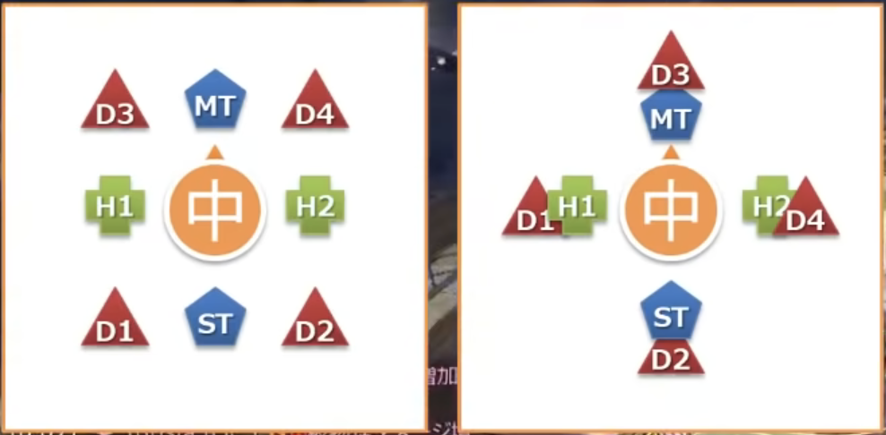
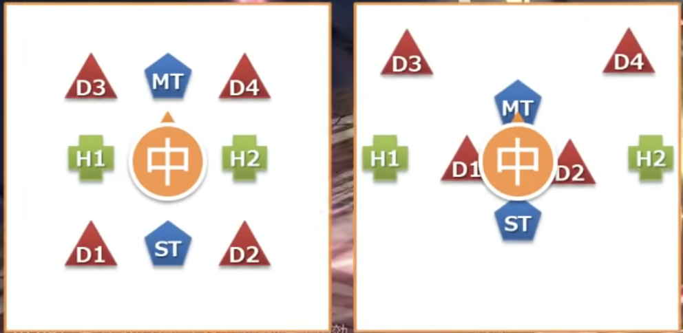

# マクロ

    ----------------------------

    ----------------------------

# 攻撃

## エレメンタルブレイク
### 炎
    8方向散開 → 頭割り

### 雷
    散開 (最初から少し遠く)

## バーンストライク
### 炎
    直線攻撃(前後・ターゲットサークルサイズ) → 敵に駆け込む
### 雷
    直線攻撃(前後・ターゲットサークルサイズ) → 下がる

## シンソイルスラスト
    線がつく！！！！
### 炎
    敵後ろで頭割り
### 雷
    敵前でタンクに挟まれる

# 光焔光背
    アドル

# 爆印刻   
    タンク スイッチ

## 転輪召
    炎 と 雷 を見る

# 至天絶技
    中央からノックバック → 炎 と 雷 の転輪召