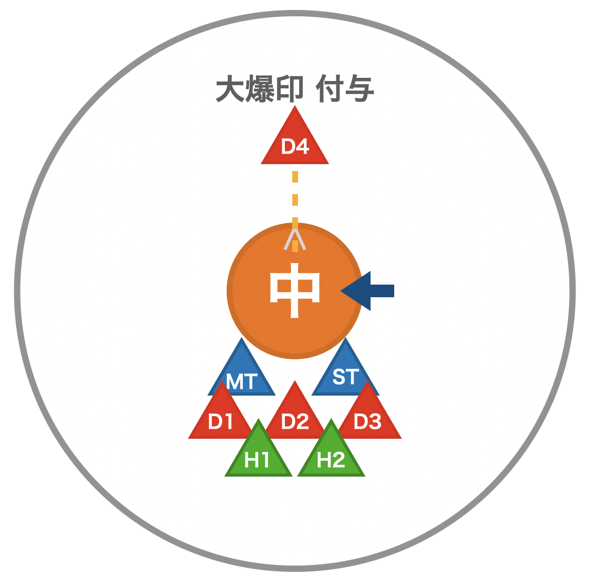
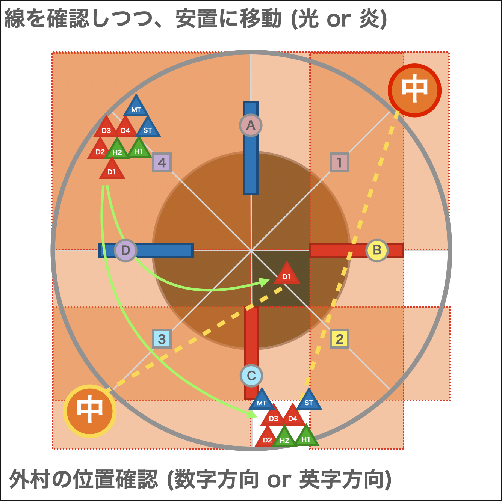
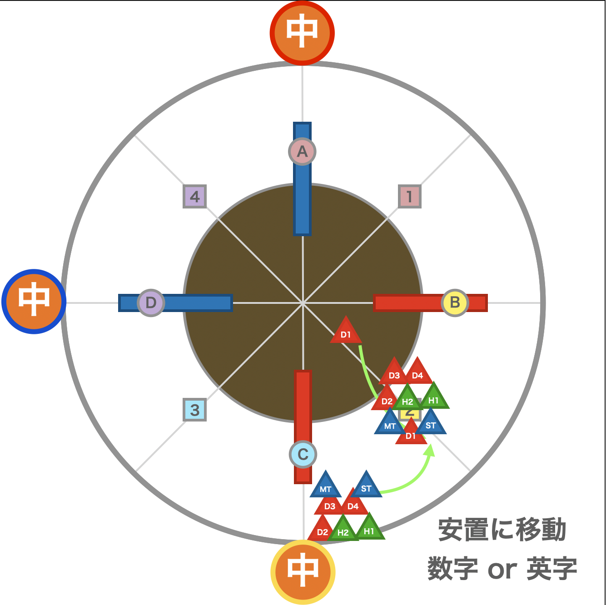

まだ作りかけ

# マクロ

    ※ 拾ってきたやつなので誰かが持ってるものに変更する予定
    【基本散開】     【ペア】
      D3 MT D4      |　　 　  D3 MT
      H1  ◎  H2     |    D1 H1 ◎ H2 D4
      D1  ST D2     |　 　　  ST D2
    【シンソイルスラスト】
       雷・光：A側(MT 対象 ST)     炎：C側
    【光エレメンタルブレイク】
    　　　    MT ST        
      H1 D1 D3 ◎ H2 D2 D4
    【転輪召】           | 【至天絶技】
      爆印刻タンク：北    |   雷+タンク：北
      他：南            |   他：南
    【四天召】
      光：北南   爆印刻：東西or無敵   炎・他：内周

    【堕獄絶技】(脳死法 ほぼララ式)
       吹き飛ばし後反時計回り   光：内周   炎：外周
       ボス板先：直線上真ん中集合→外周アムレン堅実
       ボス 45°：45°右上集合→外周アムレン堅実
    【転輪召 2回目】※固定
          　D3 MT
       H1　　　　   D4
       D1　　　　   H2
          　ST D2
    【プリズマチックインビジブル】
    腕を上げた場合：ジャンプしながら中央へ移動
    何もしない場合：不動 or 対面の人が動いたら中央へ移動

# 攻撃

## エレメンタルブレイク
### 炎
    8方向散開 → 頭割り

### 雷
    散開 (最初から少し遠く)

### 光
    散開 → ３方向頭割り

## バーンストライク
### 炎
    直線攻撃(前後・ターゲットサークルサイズ) → 敵に駆け込む

### 雷
    直線攻撃(前後・ターゲットサークルサイズ) → 下がる

### 光
    直線攻撃 → たけのこ (敵の 前方 or 後方 に逃げる)

## シンソイルスラスト
線がつく！！！！
### 炎
    敵後ろで頭割り

### 雷
    敵前でタンクに挟まれる

### 光
    対象者のみ敵の後ろ (大爆印がつく → 効果終了後に爆発)

## 光焔光背
    アドル
    DoTもつくので痛い

## 爆印刻   
    タンク スイッチ

## 転輪召
    炎 と 雷 を見る

## 至天絶技
    中央からノックバック → 炎 と 雷 の転輪召
  

## 四天召
    4枚の板が出てくる (赤2枚, 青2枚)
    纏ってない側の安置に移動 (画像は炎の場合)
    配置はランダム (同じ色は隣り合う)
    爆印タンクは外？

## 堕獄絶技
    属性を覚える
    中央からノックバック
    纏った属性側に飛ばされる
    