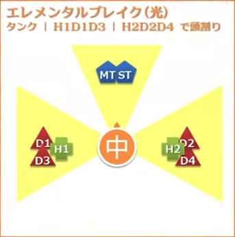
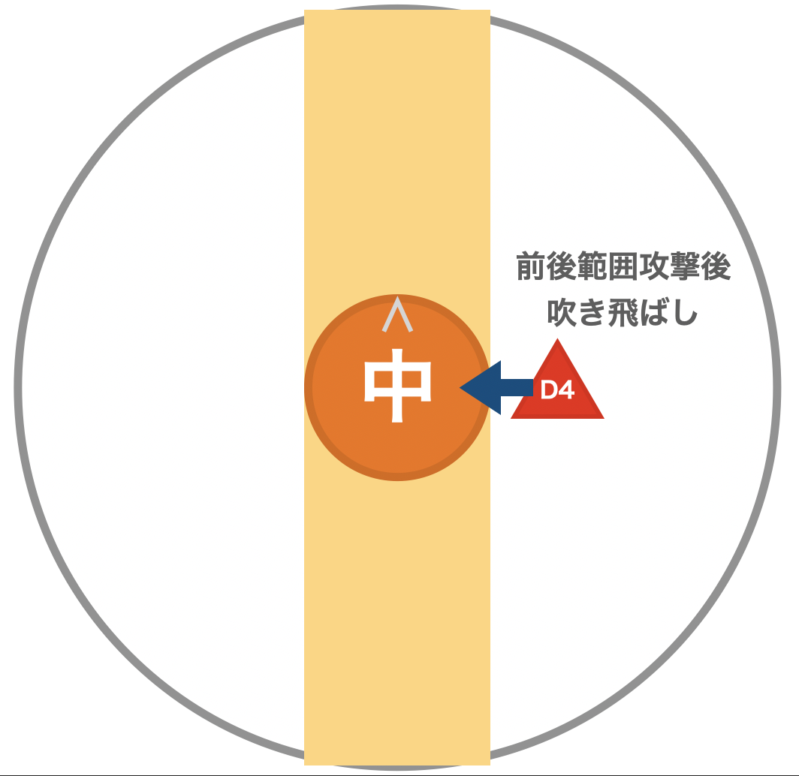
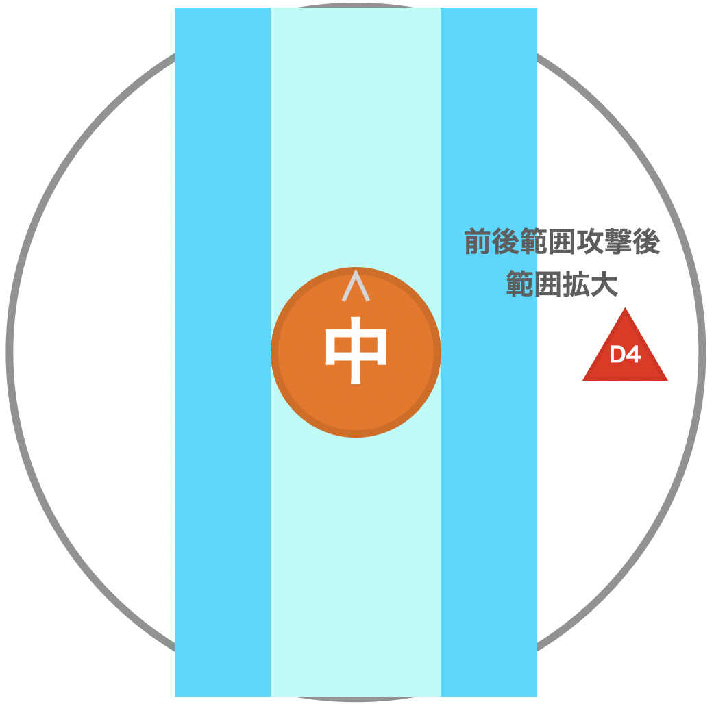
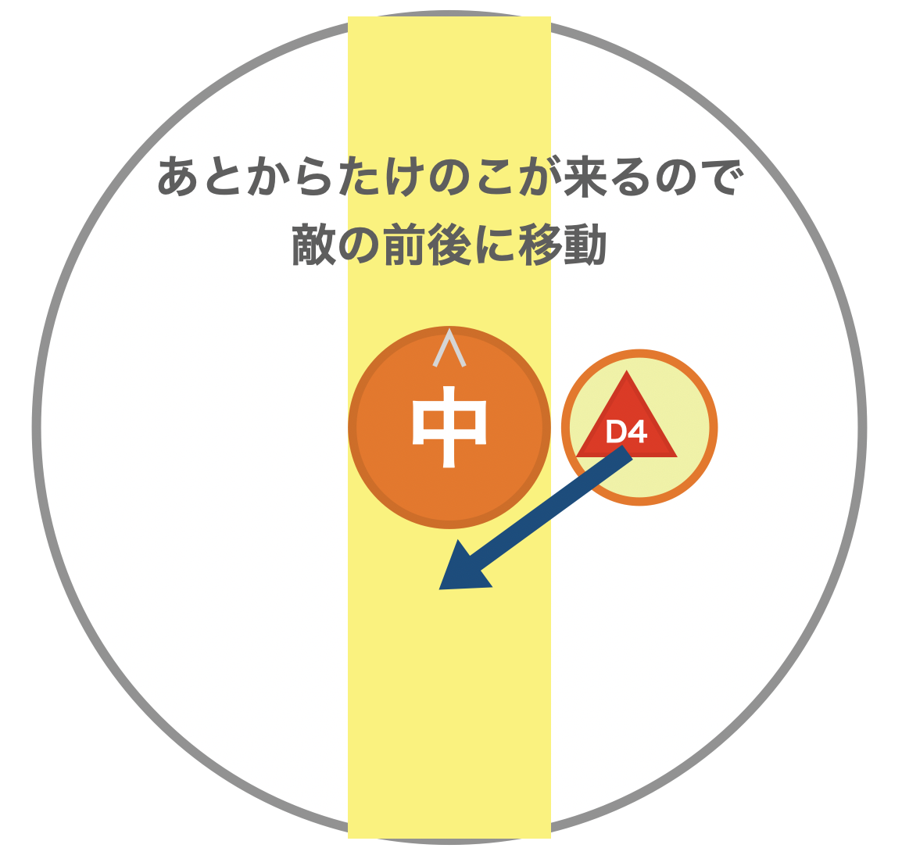
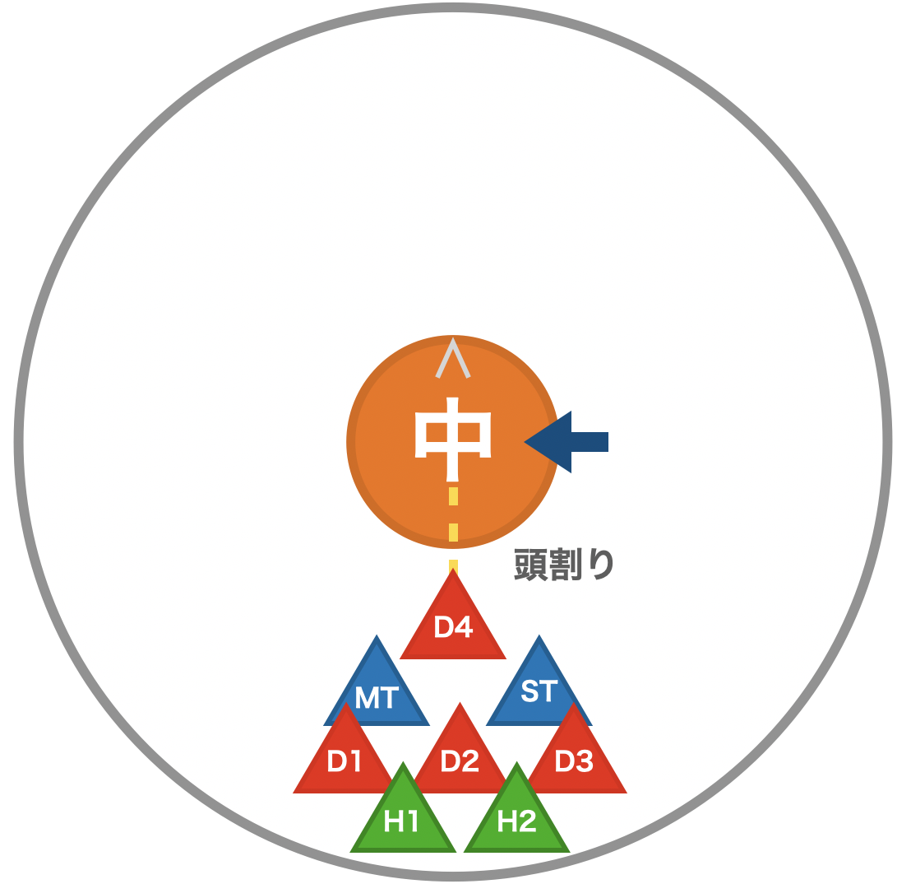
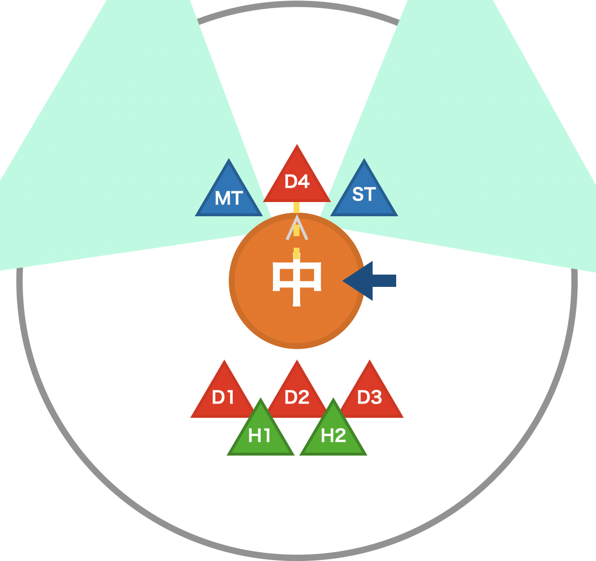
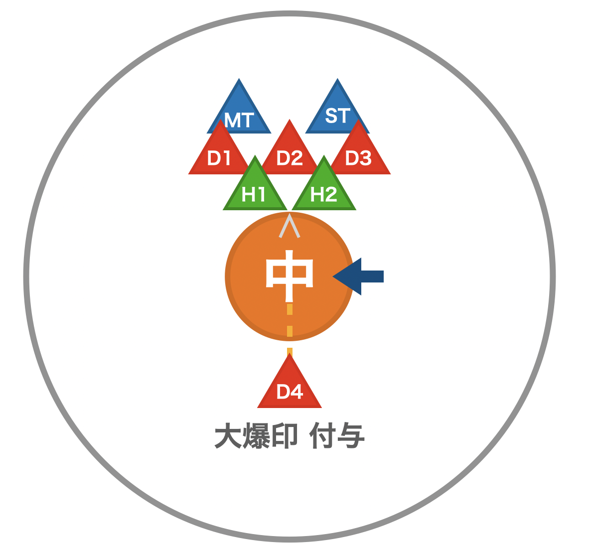

# マクロ

    ----------------------------

    ----------------------------

# 攻撃

## エレメンタルブレイク
### 炎
    8方向散開 → 頭割り

### 雷
    散開 (最初から少し遠く)

### 光
    散開 → ３方向頭割り

## バーンストライク
### 炎
    直線攻撃(前後・ターゲットサークルサイズ) → 敵に駆け込む

### 雷
    直線攻撃(前後・ターゲットサークルサイズ) → 下がる

### 光
    直線攻撃 → たけのこ (敵の 前方 or 後方 に逃げる)

## シンソイルスラスト
線がつく！！！！
### 炎
    敵後ろで頭割り

### 雷
    敵前でタンクに挟まれる

### 光
    対象者のみ敵の後ろ (大爆印がつく → 効果終了後に爆発)

## 光焔光背
    アドル
    DoTもつくので痛い

## 爆印刻   
    タンク スイッチ

## 転輪召
    炎 と 雷 を見る

## 至天絶技
    中央からノックバック → 炎 と 雷 の転輪召
  

## 四天召
    4枚の板が出てくる (赤2枚, 青2枚)
    纏ってない側の安置に移動 (画像は炎の場合)
    配置はランダム (同じ色は隣り合う)
    爆印タンクは外？

## 堕獄絶技
    属性を覚える
    中央からノックバック
    纏った属性がわに飛ばされる